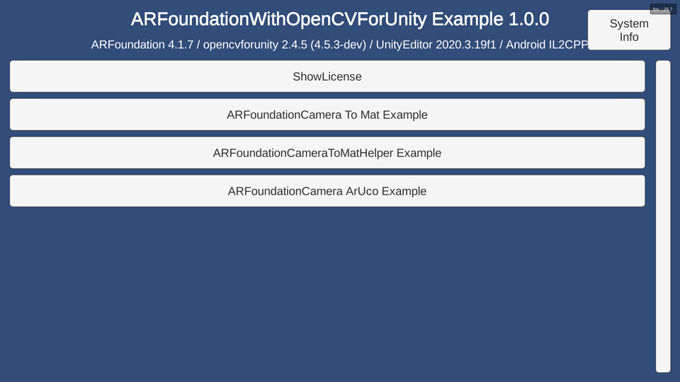
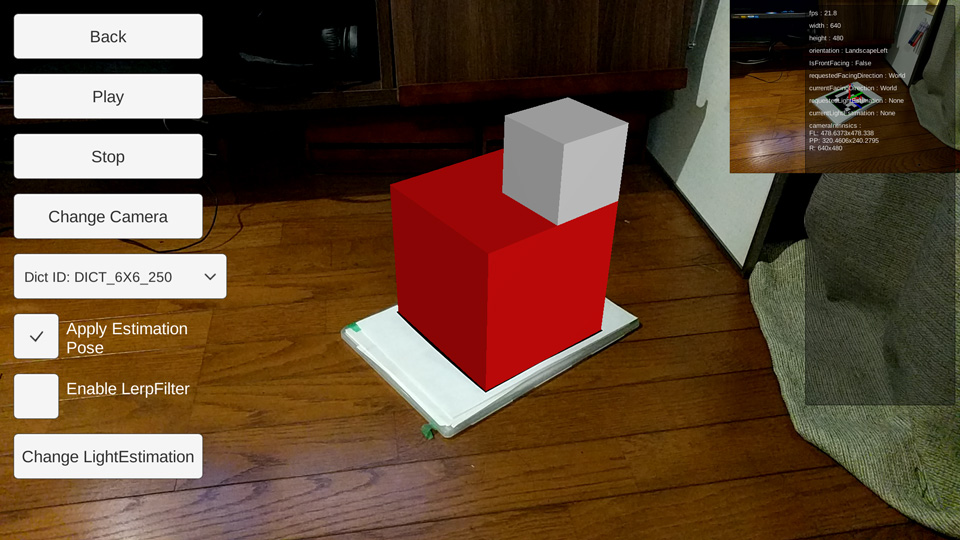

# ARFoundation With OpenCVForUnity Example
- An example of integrating ARFoundation with OpenCVForUnity.
- An example of replacing WebCamTextureToMatHelper with ARFoundationCameraToMatHelper.
- An example of ArUco marker detection from an ARFoundation camera image and overlaying AR object."

## Environment
- Android (Pixel, Galaxy S10+) / iOS (iPhoneSE2)
- Unity >= 6000.0.51f1+
- Scripting backend MONO / IL2CPP
- [AR Foundation] 6.0.5+ (To use ARFoundation 5.xx, add 'USE_ARFOUNDATION_5' to the 'Scripting Define Symbols' in the Project Settings)
- [ARCore XR Plugin] 6.0.5+
- [ARKit XR Plugin] 6.0.5+
- [OpenCV for Unity](https://assetstore.unity.com/packages/tools/integration/opencv-for-unity-21088?aid=1011l4ehR) 2.6.6+

## Demo
- Android [ARFoundationWithOpenCVForUnityExample.apk](https://github.com/EnoxSoftware/ARFoundationWithOpenCVForUnityExample/releases)

## Setup
1. Download the latest release unitypackage. [ARFoundationWithOpenCVForUnityExample.unitypackage](https://github.com/EnoxSoftware/ARFoundationWithOpenCVForUnityExample/releases)
1. Create a new project. (ARFoundationWithOpenCVForUnityExample)
1. Install AR Foundation from Package Manager.
1. Install ARCore XR Plugin from Package Manager.
1. Install ARKit XR Plugin from Package Manager.
1. Import OpenCVForUnity.
    * Setup the OpenCVForUnity. (Tools > OpenCV for Unity > Set Plugin Import Settings)
1. Import the ARFoundationWithOpenCVForUnityExample.unitypackage.
1. Change the "Player Settings (Androd)" Inspector as follows.
    * Graphics APIs : OpenGLES 3 (Remove "Vulkan" from the Graphics APIs list)
    * Minimum API Level : Android 7.0 (API Level 24)
1. Open the menu "Edit => Project Settings => XR Plug-in Management (Android)" and check "ARCore".
1. Change the "Player Settings (iOS)" Inspector as follows.
    * Camera Usage Description : "Required for augmented reality support."
    * Target minimum iOS Version : 12.0
    * Architecture : ARM64
1. Open the menu "Edit => Project Settings => XR Plug-in Management (iOS)" and check "ARKit".
    * (It seems that the camera cannot switch to the inner camera unless the Face tracking subsystem is enabled here.)
1. Add the "Assets/ARFoundationWithOpenCVForUnityExample/*.unity" files to the "Scenes In Build" list in the "Build Settings" window.
1. Build and Deploy to Android and iOS.
    *  (Print the AR marker "CanonicalMarker-d10-i1-sp500-bb1.pdf" on an A4 size paper)  

## ScreenShot
 
 
